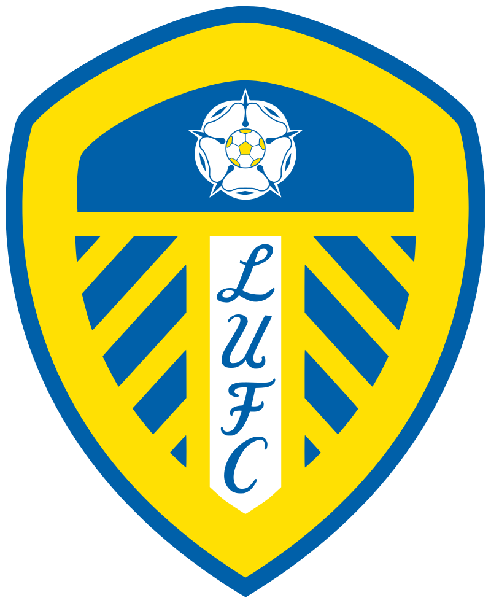

```{r setup, include=FALSE}
knitr::opts_chunk$set(echo = TRUE)
```

# Introduction


Despite recent advances that have overtaken xG

measuring shot quality instead of simply looking at the lump sum of shots taken (off and on target) by one team compared to the other. 

expected goals as a concept is still the most widely-accepted metric by the general public. 


For R users who want to dabble I highly recommend the following:

- 

- 

I started out in soccer analytics mainly to practice my data cleaning and visualization skills and over time it evolved into an entire portfolio of plots and graphs that you can see in []().

At the beginning of last season I figured out how to grab match-level data from [understat.com]() via [Ewen Henderson]()'s [{understatr}]() package and set about creating a "matchday summary graphic". These were intended to visualize the data understat.com provided in my own aesthetically-pleasing way for the general public. 

Version 1 looked like this:


In the past few months after the Corona extended season ended I intended to make tweaks to the graph above but instead I just started creating other views with the data available while also incorporating some other stuff that I couldn't fit into the original match day viz. 


"Tweak and improve existing data viz." <> "Create new viz from scratch."

One of the new viz I created was a chronological table of shots during the course of the match which provides the viewer with a lot more details about any single shot. Besides the xG value, things like the "situation" (open play? free kick? etc.), "shot type" (right, left, header), etc. were added for more context. 


2nd season so build MORE for more context 


So here are the new xG summary timelines: 


# Target Audience

# Design Choices


The color-coding of the rows is intended to give you a clear idea of who were dominating shots at any given time period at a glance without even looking too closely at the details. Of course there may be a ton of shots in a small period of time or vice-versa which can skew your perception if you don't look at the "minute" column closely. 


- sparkline timeline: no, cum xg covers that and can't see plot point easily in graph. also the nature of the chronological setup already means you get that aspect of the game anyways
better to focus on something that's easier to see at first glance as highlights the main idea of the table >> shost. 

bold text
emphasize GOALS, OWN GOALS 
add emoji to further highlight (regular version uses a star emoji instead due to HTML-to-PNG conversion issues)

title text: different sizes >> focus on actual score line then down to xG 


Concerns:

large size of file

inexperience with HTML/CSS to get team logos to slot in on either side of the title text.

necessity to be careful about what colors to use as the main team colors (yellow for example is strictly off-limits)

hard to scroll, no freeze panels >>> but made sure to order the columns in a way that it's immediately obvious what column is what regardless of how far down you are in the table.


# Packages

THe packages we'll be using are some of the usual tidyverse stalwarts such as {dplyr}, {tidyr}, {ggplot2}, {forcats}, etc. For soccer-specific packages we have the {understatr} package for downloading the data (not shown in this blog post) and the {ggsoccer} package for creating soccer fields in {ggplot2}. Last but certainly not least are {grid} and {gridExtra} which are used for advanced plot assembly. We also use the {extrafont} package to make use of some cool fonts for the table/plots, they're loaded in via the `loadfonts()` call. 

```{r}
# Packages
pacman::p_load(dplyr, tidyr, stringr, stringi, purrr,
               tibble, lubridate, glue, rlang, 
               ggplot2, grid, gridExtra, 
               gt, forcats, ggtext, extrafont, ggrepel, 
               understatr, ggsoccer)
## Load fonts
loadfonts(quiet = TRUE)
```

# Data

Data source: understat.com

Definitions for some variables are provided by hovering over column names on the website. Others are opaque but follow similar terminology set by other data companies and websites. 

Largest concern is over the accuracy of the xG model that understat uses to produce the xG values for shots. 

Used by regular public and journalists but there's never been any info given to ______ 

Most websites don't due to competitiveness of the analytics space 

but that is the biggest caveat with using the data as I'm not in control over the specific outputs of these calculated statistics. 

For the average Joe this along with the more recent FBref (advanced metrics provided by StatsBomb) are the best free and publicly available websites for obtaining this kind of data. 

It would be a point of interest to create my own xG model based on the variables provided on understat.com by following some of the "how-to" blog posts around the web such as: 

* []()

* []()


## Getting the data

How to get this data via the {understatr} package from [Ewen Henderson]() is a whole other blog post in of itself so be on the look out for one in the future. As it stands there are a number of blog posts by others that you may want to look into:

*

* 

* 

Nothing is really stopping you from using StatsBomb, Opta, InStat, WyScout, etc. data to create these tables you just need a few extra steps to prepare the data to how I've done it. 

We'll go over the variables in this data frame in more detail once we've cleaned things up.

The variables created at the bottom 

```{r}
# shots_df <- readRDS(file = here::here(glue::glue("data/LFC_LUFC_MD1_match_shots_data_clean.RDS")))
# 
# roll_sum_df <- readRDS(file = here::here(glue::glue("data/LFC_LUFC_MD1_match_rollsumxG.RDS")))

home_stats <- readRDS(file = here::here(glue::glue("data/LFC_LUFC_MD1_home_stats.RDS")))

away_stats <- readRDS(file = here::here(glue::glue("data/LFC_LUFC_MD1_away_stats.RDS")))

team_stats <- readRDS(file = here::here(glue::glue("data/LFC_LUFC_MD1_team_stats.RDS")))

home_team = "Liverpool"
away_team = "Leeds"
home_color = "#d00027" 
away_color = "#1D428A"
match_date <- "Sep. 12, 2020"
```

```{r}
match_id <- 14090
raw_match_df <- understatr::get_match_shots(match_id = match_id)

glimpse(raw_match_df)
```


```{r}
shots_df <- raw_match_df %>% 
  select(-h_goals, -a_goals) %>% 
  mutate_at(vars(minute, xG, X, Y, 
                 player_id, match_id, season), ~ as.numeric(.)) %>% 
  ## round xG values 
  ## re-label shot result categories
  mutate(#xG = if_else(is.na(xG), 0, xG) %>% round(digits = 2),
         xG = if_else(is.na(xG), 0, xG),
         result = case_when(
           result == "SavedShot" ~ "Saved Shot",
           result == "BlockedShot" ~ "Blocked Shot",
           result == "MissedShots" ~ "Missed Shot",
           result == "ShotOnPost" ~ "On Post",
           result == "OwnGoal" ~ "Own Goal",
           TRUE ~ result),
         situation = case_when(
           situation == "OpenPlay" ~ "Open Play", 
           situation == "FromCorner" ~ "From Corner",
           situation == "DirectFreekick" ~ "From Free Kick",
           situation == "SetPiece" ~ "Set Piece",
           TRUE ~ situation),
         lastAction = case_when(
           lastAction == "BallRecovery" ~ "Ball Recovery",
           lastAction == "BallTouch" ~ "Ball Touch",
           lastAction == "LayOff" ~ "Lay Off",
           lastAction == "TakeOn" ~ "Take On",
           lastAction == "Standard" ~ NA_character_,
           TRUE ~ lastAction),
         shotType = case_when(
           shotType == "LeftFoot" ~ "Left Foot",
           shotType == "RightFoot" ~ "Right Foot",
           shotType == "OtherBodyPart" ~ "Other",
           TRUE ~ shotType),
         lastAction = case_when(
           lastAction == "HeadPass" ~ "Headed Pass",
           lastAction == "BlockedPass" ~ "Blocked Pass",
           lastAction == "OffsidePass" ~ "Offside Pass",
           lastAction == "CornerAwarded" ~ "Corner Awarded",
           lastAction == "Throughball" ~ "Through ball",
           lastAction == "SubstitutionOn" ~ "Subbed On",
           TRUE ~ lastAction)) %>% 
  ## create single team_name column based on home or away
  mutate(team_name = case_when(
    h_a == "h" ~ h_team,
    h_a == "a" ~ a_team)) %>% 
  ## add colors to teams
  mutate(team_color = if_else(team_name == h_team, home_color, away_color)) %>% 
  ## swap over own goals to the other team
  mutate(team_name = case_when(
    result == "Own Goal" & team_name == home_team ~ away_team,
    result == "Own Goal" & team_name == away_team ~ home_team,
    TRUE ~ team_name)) %>% 
  mutate(team_name = forcats::as_factor(team_name)) %>% 
  ## make sure that shots are in order
  arrange(id) %>% 
  separate(player, into = c("firstname", "player"), 
           sep = "\\s", extra = "merge") %>% 
  ## players like Fabinho are listed without a last name "Tavares"
  ## so just add their name in again if NA
  mutate(player = if_else(is.na(player), firstname, player),
         ## overwrite ID numbers so they go from 1 to n.
         id = row_number())
```


Note: Raw xG values for Mane's initial shot: 0.31 while Bobby's goal: 0.82. But you have to adjust xG for a single sequence of possession so I regularly use the code in @joedgallagher's 📝: https://jogall.github.io/2019-01-16-adjusted-xG/ for adjusting them whenever there's a sequence with a rebound. 

The xG totals you see on understats' match pages are using the ADJUSTED values BUT the xG values you see on their shot maps are the RAW values. So do be careful when you're taking shot data from the website because I know a lot of you grab data en masse from there...


99% of the time the discrepancy has been solved by applying this ___ to rebound shots and other shots in the possession sequence. Understat could be doing something else but from my experience this usually matches the values up.

```{r}
shots_df %>% filter(team_name == "Liverpool") -> lfc_xg

lfc_adj <- lfc_xg %>% 
  filter(minute == 39) %>%
  mutate(xg_total = (1 - prod(1 - xG))) %>%
  mutate(xg_adj = xg_total * (xG / sum(xG))) %>% 
  select(minute, xG, xg_adj, player, situation, lastAction)

glimpse(lfc_adj)

shots_df <- shots_df %>% 
  mutate(xG = case_when(
    minute == 39 & id == 10 ~ 0.10171848,
    minute == 39 & id == 11 ~ 0.08383471,
    TRUE ~ xG))
```


Be very careful and make sure that the rows are ordered properly before running this function.

```{r}
## get minute of last shot
last_min <- shots_df$minute %>% unique() %>% last()

## if last shot happened before 90th minute then change to 90
if (last_min < 90) {last_min <- 90}

## index of every minute in match
minute <- c(0:last_min)
team_name <- c(shots_df$h_team %>% unique(),
               shots_df$a_team %>% unique())

rollsum_df <- shots_df %>% 
  full_join(crossing(minute, team_name)) %>% 
  arrange(minute) %>% 
  group_by(team_name) %>% 
  mutate(xG = if_else(is.na(xG), 0, xG),
         rollsum = lag(cumsum(xG))) %>% 
  ungroup() %>% 
  mutate(player_label = case_when(
    result == "Goal" & situation != "Penalty" ~ paste0(player, ": ", round(xG, digits = 2), " xG"),
    result == "Goal" & situation == "Penalty" ~ paste0(player, " (Penalty): ", round(xG, digits = 2), " xG"),
    result == "Own Goal" ~ paste0(player, " (Own Goal): ", round(xG, digits = 2), " xG"),
    TRUE ~ ""),
    rollsum_goal = rollsum + xG,
    minute_goal = minute + 1) %>% 
  ## for Minute == 0
  mutate(rollsum = if_else(is.na(rollsum), 0, rollsum),
         rollsum_goal = if_else(is.na(rollsum_goal), 0, rollsum_goal)) %>% 
  ## for Minute 0
  add_row(team_name = home_team, minute = 0, minute_goal = 0,
          rollsum = 0, rollsum_goal = 0,
          xG = 0) %>% 
  add_row(team_name = away_team, minute = 0, minute_goal = 0,
          rollsum = 0, rollsum_goal = 0,
          xG = 0) %>% 
  ## FOR THIS BLOGPOST // GT TABLE WE DON'T NEED MOST OF THESE COLUMNS
  ## We'll only use the shot order ID and the rolling sum of xG that we just calculated.
  filter(xG != 0.00) %>% 
  select(id, rollsum_goal)
```

## Shape of data

Now let's go over what are the data frames you need to create these tables and plots. 

1. shots_df

This data frame is the main protagonist for our table and holds pretty much all the essential info we need. You can add/subtract any columns as you see fit from understat or from your own data source here. 

```{r}
glimpse(shots_df)
```

* Minute: Minute of the game that the shot was taken. Note that this doesn't contain seconds so you need to be careful when re-arranging rows. When you get the data via {understatr} the data should come in proper order so the first thing you should do is to create an ID variable so that you always have shots in the same minute in the proper order. 

* result: The result of the shot. "Goal", "Blocked Shot", "Saved Shot", "Own Goal", etc.

* X & Y: Coordinates of the shot location.

* xG: Expected Goals value of the shot taken per understat.com's model.

* firstname & player: Player name. firstname is a column I created myself for the shot time line/ shot maps in a previous step of my viz process. When you're grabbing the data from understat yourself it should already be in one united column. We'll go over the code to combine these together for the table.

* h_a: Home or away team. These are used for matching the team colors to their respective row and is in general useful when you have turned your code into a function and want to set certain conditions depending on whether the team is "home" or "away". 

* player_id & match_id: understat IDs for players and matches. Not used here but good to keep if you're going to be doing other stuff later on. 

* situation: The situation in which the shot took place. "Open Play", "Set Piece", "Penalty", etc. 

* season: Season. Not used here but good to keep if you're doing other stuff with this data. 

* shotType: Type of shot. "Left Foot", "Right Foot", & "Header". 

* date: Date of match. We could use {lubridate} or something to make it look nice but for this example I just manually created a variable "match_date" which you saw when we loaded in all the data. 

* player_assisted: Player that assisted the shot. Do note that "assisted" could mean very trivial things like a small touch or a deflection.

* lastAction: Action that lead to the shot. "Pass", "Dribble", "Take On", "Cross", "Rebound", etc. There are some mystery labels such as "Standard" but we'll be removing them from the data in the code section. 

* team_name: Team name used for labels.

2. rollsum_df

Has the rolling sum of xG values for the match over every shot taken in the match.

```{r}
glimpse(rollsum_df)
```

3. home_stats & away_stats 

The box score you see in the "Stats" tab of the match page on understat.com. "home_stats" and "away_stats" is just "team_stats" divided into their respective teams. The data below are ONLY used for labels and titles in the plot so if you're not too fussed about being able to scrape the data you could just manually insert them in the text (we'll be using `paste()`/`glue()` to insert this into the plot text) or add the info as arguments to your plotting function and insert this data that way as well.

```{r}
glimpse(team_stats)
```

# Code Breakdown

## Creating the soccer field plots

For the actual soccer field I use the {ggsoccer} package. Along with the pitch dimension specifications for data sources like Opta, WyScout, and StatsBomb, the package also allows you to specify your own dimensions to fit your own data. If you want a bit more of an in-depth code through using the {ggsoccer} package, take a look at the package [README](https://github.com/Torvaney/ggsoccer) or have a look at one of my [first blog posts](https://ryo-n7.github.io/2018-06-29-visualize-worldcup/) where I create my own World Cup 2018 data and visualize it with {ggsoccer}. 

After playing around with the dimensions on understat the below are the measurements what I came up with and I defined it as a variable called `pitch_custom`. 

```{r}
pitch_custom <- list(
  length = 587,
  width = 373,
  penalty_box_length = 101,
  penalty_box_width = 211,
  six_yard_box_length = 31,
  six_yard_box_width = 111,
  penalty_spot_distance = 66,
  goal_width = 45,
  origin_x = 0,
  origin_y = 0)
```

Since we are orienting the shot maps vertically we need to convert the coordinates from the horizontal view to vertical. We are only using one side of the pitch we don't need to have different adjustments for the "home" and "away" teams. The new coordinates will be defined to the variables "X" and "Y" capitalized, the lower-case coordinates will be kept in just as a reference and for checking positions. Then we `select()` only the variables we need then capitalize "Goal" and "Own Goal" labels for the table (you could also use `stringr::str_to_upper()` here). Also note that you can include most if not **all** of these `mutate()` calls into **one** `mutate()` call but I like to keep them separated so I can comment out blocks of code easier. 

```{r}
## create coords
match_df <- shots_df %>% 
  ## switch coordinates for vertical view
  mutate(
    x = case_when(
      h_a == "a" ~ X * 587,
      h_a == "h" ~ X * 587,
      TRUE ~ 0),
    y = case_when(
      h_a == "a" ~ Y * 373,
      h_a == "h" ~ Y * 373,
      TRUE ~ 0)) %>%
  ## edit result values
  mutate(result = case_when(
    result == "Goal" ~ "GOAL",
    result == "Own Goal" ~ "OWN GOAL",
    TRUE ~ result)) %>% 
  mutate(result = forcats::as_factor(result),
         result = forcats::fct_relevel(result, "GOAL", "Saved Shot",
                                       "On Post", "Blocked Shot", 
                                       "Missed Shots", "OWN GOAL"))
```

This is how the data looks like now. There's a row for every shot in chronological order along with the coordinates for the shots.

```{r}
glimpse(match_df)
```

Using this data frame we can create shot map plots that will serve as the base for a more detailed plot in a later section.

### Function to define base shot map

This function will take the `data` and `team_name` inputs that come from the `match_df` data frame that we just created. This plot will plot **all** shots per team for every row of the data frame. After using `filter()` to only get the shots for the specific team, `annotate_pitch()` is used to create the pitch object using the dimensions we specified in `pitch_custom` earlier. The `theme_pitch()` is a helper function for {ggsoccer} that removes all the background and axes details while `coord_flip()` is used to flip the field so that the goal is at the top of the plot. All the shots will be gray and transparent (via the 'alpha' argument) as later on we will highlight the actual shot for a specific row in our table in a different plotting function. 

```{r}
create_shotmap_basic <- function(df = data, team_name = team_name) {
  
  shotxG_map_raw <- 
    ggplot(df %>% filter(team_name == team_name), 
           aes(x = x, y = y)) +
    annotate_pitch(dimensions = pitch_custom) +
    ## all shots in grey and transparent
    geom_point(aes(x = x, y = y), color = "grey20", 
               size = 3, alpha = 0.3) +
    #scale_x_continuous(expand = c(0.01, 0)) +
    theme_pitch(aspect_ratio = 373/587) +
    coord_flip(xlim = c(280, 590), 
               ylim = c(10, 365)) +
    theme(plot.margin = unit(c(0.1, 0.1, 0.1, 0.1), "pt"),
          text = element_markdown(family = "Roboto Condensed"),
          legend.position = "none")    
  
  return(shotxG_map_raw)
}
```

We `nest()` the data by "team_name" so that when we plot our basic shot maps each row will plot all the shots for each team in "team_name". By "nesting" the data this way we can apply the plotting function to **all** the data for a specific team team. This way we won't be plotting a basic shot map using shot data from both teams. 

```{r}
match_df %>% tibble::as_tibble() %>% group_by(team_name) %>% nest()
```

The "data" column contains **all** the data that we saw previously for each team. If we `unnest()` the "data" column for the row with "Liverpool" in the "team_name" column we can see that it contains all the data seen previously but **only** for Liverpool. The same will apply if we "unpack" the "data" column for the row with Leeds United. 

```{r}
match_df %>% 
  tibble::as_tibble() %>% 
  group_by(team_name) %>% 
  nest() %>% 
  head(1) %>% 
  unnest(cols = c(data))
```

With this data structure in hand, we apply the basic shot map plot function to every row of data inside the "data" column for both teams. We can do this by passing the "data" and "team_name" columns as the arguments to the shot map function which then iterates over every row in each team's "data" column. 

```{r}
## add blank shot map to all rows
match_df_basic_plot <- match_df %>% 
  tibble::as_tibble() %>% 
  ## nest by team
  group_by(team_name) %>% 
  nest() %>% 
  ## apply plots for all shots per team, for each row in their respective "data" column
  mutate(plot = map2(data, team_name, create_shotmap_basic)) %>% 
  ungroup()
```

When we take a `glimpse()` at our data frame we now see an additional column, "plot" that houses plots for each row of shots for both teams. So Liverpool took 22 total shots and therefore have 22 rows inside "data" which results in 22 plots while for Leeds there are 6, 6, and 6 of the same. Both "data" and "plot" are now what are called "list-columns".

```{r}
glimpse(match_df_basic_plot)
```

So now we have a data frame with a basic shot map for each team for each row of shots. However, all of the detailed info we need for our table is hidden inside the "data" column. We can get those back by `unnest()`-ing the "data" column so all the other shot information is unpacked. 

```{r}
match_df_basic_plot <- match_df_basic_plot %>% 
  unnest(cols = "data") %>% 
  arrange(id)

glimpse(match_df_basic_plot)
```

### Function to define specific shot map

This second plotting function takes the plots we created with the previous base shot map function and adds in the specific shot for each row to the base plot. The "plot" that is being passed into this function are all the plots we had saved in the "plot" column of the data frame. We add in a new `geom_point()` for the specific shot recorded in a row and make it bigger in size and in black to make it stand out from the rest of the shots the team took. At the bottom we add in a label for the xG value.  

```{r}
add_xG_shot <- function(x, y, xG, team_color, plot) {
  shotxG_map_point <- 
    plot +
    # specific shot point in black and bold
    geom_point(x = x, y = y, aes(fill = team_color),
               size = 12, stroke = 3, shape = 21) +
    scale_fill_identity() +
    #scale_x_continuous(expand = c(0.01, 0)) +
    ## label for shot point
    geom_label(x = 318, y = 186.5, 
               color = "black", size = 20,
               fill = "white", family = "Roboto Slab",
               label = glue::glue("{xG %>% round(digits = 2)} xG"))
  
  return(shotxG_map_point)
}
```

## Combining plots to data frame

Now we finally work with the data frame that has the rolling xG sums. The IDs should match up with the IDs in `match_df_basic_plot` because the `roll_sum_df` data frame is just an expanded version of `match_df_basic_plot` that created empty rows for every minute. Once you `filter()` out those rows without an xG value the rows for both should match up. Be very careful when manipulating both of these data frames in previous steps as it can become very easy for the IDs to get messed up especially when there are multiple chances by either team in the same minute. Make sure the row order of the shots data frame is exactly as downloaded from `understat.com` before applying the IDs to the rows.

Since we have more than two arguments that we are passing to the `add_xG_shot()` function we need to iterate over every row using the `pmap()` function instead of `map2()`.

```{r}
## map plot to df again with a shot point for each row/plot
dfdfdf <- match_df_basic_plot %>% 
  ## shot-per-row, using 'plot' as base pass along the 'x', 'y' coordinates and xG value
  ## to "add_xG_shot()` function for each row. 
  ## have empty 'ggplot' column for gt plot-insertion purposes
  mutate(complete_plot = pmap(list(x, y, xG, team_color, plot), add_xG_shot),
         ggplot = NA) %>% 
  select(-plot) %>% 
  left_join(rollsum_df, by = "id")
```

We can check the data frame for the plot in the first row, which is the first shot in the game from Mo Salah in the 7th minute.

```{r}
dfdfdf$complete_plot[[1]]
```

Now for a plot for a row where the team is Leeds United. You can see that the plot is different from the Liverpool one as the "grey"-ed out shots are Leeds' other shots. This is because of what we did earlier in creating the "basic" shot map for each team separately.

```{r}
dfdfdf$complete_plot[[4]]
```

## Tidying up to prep for table creation

We are now very close to the data frame we need to start making the table.

```{r}
glimpse(dfdfdf)
```

There are a lot of columns that we won't really need for the table so we'll do some final cleaning up before we get to the {gt} table code. We `select()` for the columns that hold the info that we really need and then make edits to `lastAction` column to clean them up a bit. We replace any `NA`s with a blank so they don't show up in the table as `NA` text. A new `player_name` column is created by concatenating the `firstname` and `player` (which contains the player's last name) columns into one. Finally we use the new `relocate()` function to place the newly created `player_name` column to be placed after the `team_name` column. 

```{r}
## data creation for actual table
match_shots_table_df <- dfdfdf %>% 
  select(minute, team_name, result, xG, firstname, player, 
         ggplot, complete_plot, rollsum = rollsum_goal,
         situation, type = shotType, player_assisted, lastAction) %>% 
  ## player name labels, clean "lastAction"
  mutate(player_name = paste(firstname, player),
         lastAction = if_else(lastAction == "None", NA_character_, lastAction),
         xG = xG %>% round(digits = 2),
         rollsum = rollsum %>% round(digits = 2)
         ) %>% 
  ## NAs as blanks
  mutate(across(where(is.character), ~ replace_na(., ""))) %>% 
  ## take out extraneous name vars and move to after team name
  select(-firstname, -player) %>% 
  relocate(player_name, .after = team_name) 

glimpse(match_shots_table_df)
```

## The table

To give rows where the shots are goals a bit of 'oomph' in the table, we will add a soccer ball emoji next to the all-caps "GOAL" text. We can add in the unicode version of the emoji as an object that we'll then `paste()` into the text. From my attempts it only works well for the `.HTML` output and for the `.PNG` output I use for my regular match summary graphics I have to use a "star" emoji instead as the soccer ball one doesn't render too well in `.PNG`.

```{r}
soccer_ball <- "<span style='color:white;font-size:25px'>&#9917;</span>"
```

To start off, we add in the title and team logo images via (extremely bad) HTML code. This is the part I'm least happy with as ideally there wouldn't be a big gap between the score line and the subtitle text while still having the team logo images set on either side of the entire text block. In reality you'd use CSS to have the team logos be independent of the HTML code that does all the styling on the title text but I'm not knowledgeable enough at it at this point. The way I've done it below is the best way I could do it without making it worse. The way I've done it with HTML means that on screens that aren't very wide, the away team's logo will shift downwards and it'll look bad. So let's just say it isn't very mobile friendly right now. To be honest it's only wide-screen monitor friendly at this point! 

```{r}
match_gt_xG_timeline <- 
  gt(match_shots_table_df) %>% 
  tab_header(   
    title = gt::html("<p><span style='font-size:35px'>(3.15 xG)</span> <b style='color:#d00027; font-size:55px'>Liverpool</b> <span style='font-size:70px'>4 - </span><span style='font-size:70px'>3</span> <b style='color:#1D428A; font-size:55px'>Leeds</b> <span style='font-size:35px'>(0.27 xG)</span> 
</p>
<span style='font-size:40px'>Premier League 2020-2021: Matchday 1 (Sep 12 2020)</span>"
    )
  )


#"<p><span style='font-size:35px'>({home_stats$xG} xG)</span> <b style='color:{home_color}; font-size:55px'>{home_team}</b> <span style='font-size:70px'>{home_stats$GOALS} - </span><span style='font-size:70px'>{away_stats$GOALS}</span> <b style='color:{away_color}; font-size:55px'>{away_team}</b> <span style='font-size:35px'>({away_stats$xG} xG)</span></p> <p><span style='font-size:40px'>Premier League 2020-2021: Matchday 1 ({match_date})</span></p>"
```


Image files need to be placed in output folder


Styling the individual cells of our {gt} table can be done via the `tab_style()` function. Throughout the titles and headers we use the font `Roboto Slab` which is a thicker version of the `Roboto Condensed` font that I use for nearly all of my visualizations. 

First, we add some styling to the title text that we just created above. We can specify that the cells we want to style via the `locations` argument and setting that to "title" via the `cells_title()` function. For the actual styling via the `style` argument, we can specify font, weight, color, etc. via the `cell_text()` function. 

For styling the column headers we specify the `location` with the `cells_column_labels()` function. The special `everything()` helper function (from the {tidyselect} package) is used as we want to specify the style for all column headers. We want the text in the column headers to stand out so we make them extra big by specifying the size to be `xx-large` and weight `bold`. 

We also want to add some small vertical borders to the column headers so they are divided up, styles for borders can be specified via the `cells_borders()` function. 

```{r}
match_gt_xG_timeline <- 
  match_gt_xG_timeline %>% 
  ## title style
  tab_style(
    style = list(
      cell_text(
        font = "Roboto Slab",
        align = "center",
        weight = "bold",
        color = "#000000"
      )
    ),
    locations = list(
      cells_title(groups = "title")
    )
  ) %>% 
  ## column style
  tab_style(
    style = list(
      cell_text(font = "Roboto Slab", align = "center", 
                size = "xx-large", weight = "bold"),
      cell_borders(sides = c("left", "right"), 
                   color = "grey20", weight = px(2))
    ),
    locations = list(
      cells_column_labels(everything())
    )
  ) 
```

To style the rows for either team we have to do a bit more in the `locations` argument of `tab_style()`. Using `filter()`-style syntax we specify the rows so that the `team_name` column matches the value of either the `home_team` (Liverpool) or `away_team` (Leeds United). For rows where Liverpool took a shot we fill the cells with `home_color` "red" and for Leeds `away_color` or "blue". We specified the `home_color` and `away_color` variables at the beginning of the tutorial. When all of this code is turned into a function, you would have these variables set as arguments to the table-making function so you can easily specify any color hex code as needed. 

```{r}
match_gt_xG_timeline <- 
  match_gt_xG_timeline %>% 
  ## HOME TEAM
  tab_style(
    style = cell_fill(color = home_color),
    locations = cells_body(
      rows = team_name == home_team)
  ) %>% 
  ## AWAY TEAM
  tab_style(
    style = cell_fill(color = away_color),
    locations = cells_body(
      rows = team_name == away_team)
  ) %>% 
  ## all cell text
  tab_style(
    style = cell_text(color = "white", align = "center", size = "x-large",
                      font = "Roboto Condensed", weight = "bold"),
    locations = cells_body(
      columns = TRUE) 
  ) 
```

In this section of the {gt} code we go over the `text_transform()` function for doing two very different operations,  for appending the soccer ball emoji unicode to the "GOAL" or "OWN GOAL" cells and for adding the shot maps we created earlier into the table.

We can use the `text_transform()` function to pass a inline function that appends the soccer ball emoji unicode next to either "GOAL" or "OWN GOAL" text via `paste()`. In specifying the exact location, we have the columns point to the "result" column and filter for rows that have "GOAL" or "OWN GOAL" in the respective "result" column. 

```{r}
match_gt_xG_timeline <- 
  match_gt_xG_timeline %>% 
  ## add Goal result emoji by pasting in the emoji next to the 'result' text
  text_transform(
    locations = cells_body(
      columns = vars(result),
      rows = result %in% c("GOAL", "OWN GOAL")),
    fn = function(x) paste(x, soccer_ball)
  ) 
```

To get our shot map plots to show up in the table we pass a different inline function to `text_transform()`. We can use the `ggplot_image()` helper function which generates an HTML fragment of a ggplot object. We `map()` the function over every row in the table to generate the shot maps for every row. The "height" and "aspect_ratio" arguments are passed along to `map()` to set the dimensions for the plot inside the cells of the table. 

```{r}
match_gt_xG_timeline <- 
  match_gt_xG_timeline %>% 
  ## add plots into the empty 'ggplot' column
  ## use `ggplot_image()` function and set height and aspect ratio
  text_transform(
    locations = cells_body(columns = vars(ggplot)),
    fn = function(x) {
      map(match_shots_table_df$complete_plot, ggplot_image, height = px(150), aspect_ratio = 2)
    }
  )


# match_gt_xG_timeline %>% 
#   fmt_number(
#     columns = vars(xG, rollsum),
#     n_sigfig = 3,
#     drop_trailing_zeros = FALSE
#   ) %>% 
#   cols_hide(vars(complete_plot))
```

Using the `cols_label()` function we can easily re-name all of the column headers to a more table-friendly name. The `cols_align()` is used to align the text of columns. 

```{r}
match_gt_xG_timeline <- 
  match_gt_xG_timeline %>% 
  ## Rename cols
  cols_label(
    minute = "Minute", team_name = "Team", player_name = "Player", 
    result = "Result", xG = "xG", rollsum = "Cumulative xG", 
    ggplot = "Shot Map", situation = "Situation", 
    type = "Shot Type", lastAction = "Assist Action", player_assisted = "Assist Player"
  ) %>% 
  cols_align("center")
```

The `tab_options()` function is a very general function that gives you a lot of options for styles similar to `tab_style()` except without having to bother with specifying the location and such. For our purposes I'm using this to add a thick gray border at the top and bottom of the column headers. This can be done ia `tab_style()` like we did for the "left" and "right" vertical borders but I didn't want to bother with the whole `tab_style()` syntax all over again. You could just add another `tab_style()` function and just specify the "sides" in `cells_borders()` to "top" and "bottom" if you want to do it that way. We make the top and bottom borders of the column labels a bit thicker to separate them from the title and the body of the table by setting the width to be `px(5)` (px stands for pixel).

The "data_row.padding" argument sets the amount of vertical padding to each row of the table while "source_notes.font.size" is fairly self-explanatory. We set the actual text for the source note via the `tab_source_note()` function. Instead of using HTML to style the text, we can use markdown via the `md()` function and style the text using regular markdown syntax. 

Finally we use the `cols_hide()` function to hide the columns that we don't want to show. 

```{r}
match_gt_xG_timeline <- 
  match_gt_xG_timeline %>% 
  ## general table options
  tab_options(
    column_labels.border.top.color = "grey",
    column_labels.border.top.width= px(5),
    column_labels.border.bottom.color = "grey",
    column_labels.border.bottom.width= px(5),
    data_row.padding = px(15),
    source_notes.font.size = 20
  ) %>% 
  tab_source_note(source_note = md("**Table**: Ryo Nakagawara (**Twitter**: @R_by_Ryo) | **Data**: understat")) %>% 
  cols_hide(vars(complete_plot, xG))
```


[link to complete table]() 


# Complete function

We can wrap this all up in a neat function that takes a few useful and flexible arguments so that we can use the code and apply it to other matches.

```{r}

```


# Examples


[Code link]()


[Code link]()


## Save online to RPubs

Taking the first three letters of the home and away team via `str_sub()` and then pasting them in to the file name with `glue()`. 

```{r eval=FALSE}
hom <- home_stats$TEAMS %>% str_sub(., 1, 3)
awa <- away_stats$TEAMS %>% str_sub(., 1, 3)

gtsave(match_gt_xG_timeline, here::here(glue("RMD/output/{hom}{awa}_match_gt_shotmap8.html")))
```


```{r eval=FALSE}
markdown::rpubsUpload(title = "gt-test.html", here::here("RMD/output/LivLee_match_gt_shotmap.html"))
```


# Acknowledgements


# Conclusion & Future Steps


DARK MODE!


